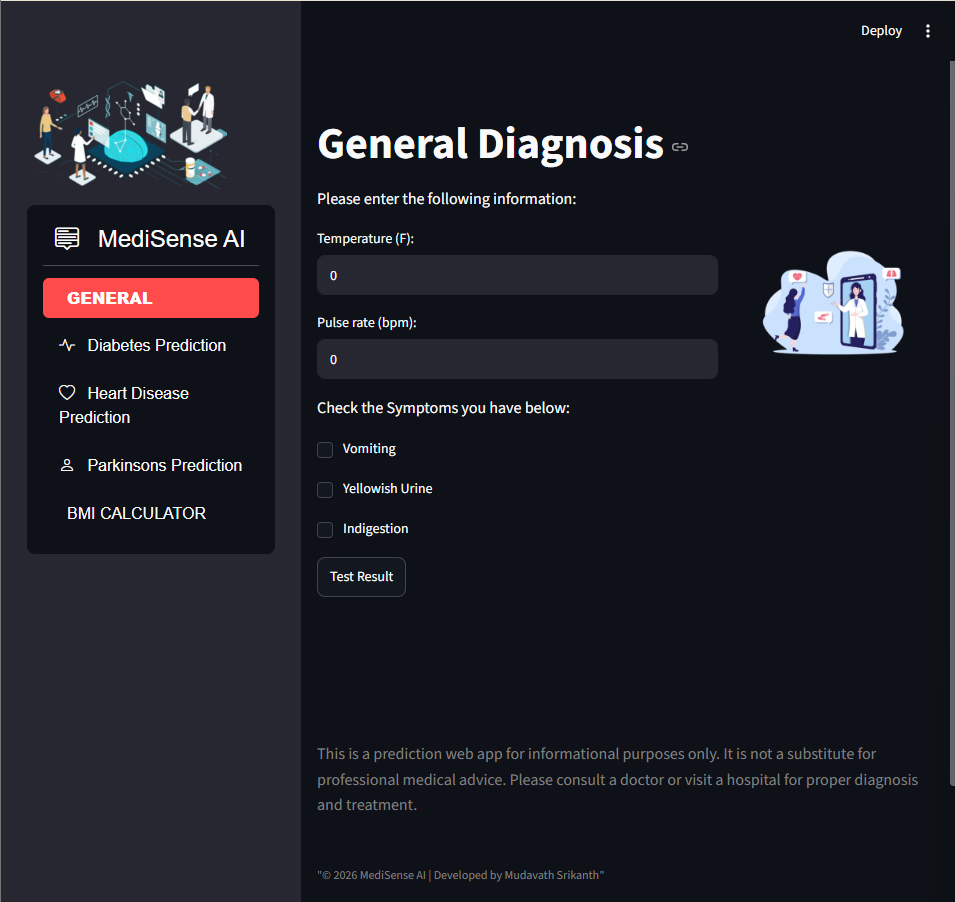

# 🏥 MediSense AI

## AI-Powered Disease Prediction & Personalized Healthcare Recommendation System


# 📖 Project Overview

MediSense AI is a Machine Learning-powered healthcare application that predicts diseases based on user symptoms and provides intelligent healthcare recommendations. The application offers an easy-to-use web interface where users can enter symptoms and receive predictions along with useful medical guidance.

The project aims to demonstrate the practical application of Machine Learning in healthcare by assisting users with early disease prediction and personalized health recommendations.

---

# ✨ Features

✅ Disease Prediction from Symptoms

✅ Diabetes Prediction

✅ Heart Disease Prediction

✅ Parkinson's Disease Prediction

✅ BMI Calculator

✅ Personalized Healthcare Recommendations

✅ Medicine Suggestions

✅ Interactive Streamlit Dashboard

✅ Responsive User Interface

---

# 🛠 Technologies Used

### Programming Language

- Python

### Machine Learning

- Scikit-learn
- Joblib

### Data Processing

- Pandas
- NumPy

### Data Visualization

- Matplotlib
- Seaborn
- Plotly

### Web Framework

- Streamlit

---


# 🚀 Installation

## 1. Clone Repository

```bash
git clone https://github.com/MUDAVATH-SRIKANTH/MediSense-AI.git
```

---

## 2. Open Project

```bash
cd MediSense-AI
```

---

## 3. Create Virtual Environment

```bash
python -m venv venv
```

---

## 4. Activate Virtual Environment

Windows

```bash
venv\Scripts\activate
```

Linux / Mac

```bash
source venv/bin/activate
```

---

## 5. Install Dependencies

```bash
pip install -r requirements.txt
```

---

## 6. Run Application

```bash
python -m streamlit run app3.py
```

---

# 📸 Screenshots

## 🏠 Home Page



---


# ⚙ Machine Learning Models

The application uses the following Machine Learning algorithms:

- Decision Tree
- Support Vector Machine (SVM)
- Logistic Regression

These models are trained using healthcare datasets to predict diseases based on user input.

---


# 💻 How It Works

1. User enters symptoms.
2. Machine Learning model analyzes the symptoms.
3. Disease prediction is generated.
4. Personalized recommendations are displayed.
5. User can view health-related guidance.

---

# 🎯 Applications

- Healthcare Assistance

- Disease Risk Assessment

- Medical Education

- AI Healthcare Research

- Machine Learning Demonstration

---


# 👨‍💻 Developer

**Mudavath Srikanth**

Final Year B.Tech (Artificial Intelligence & Machine Learning)

---

